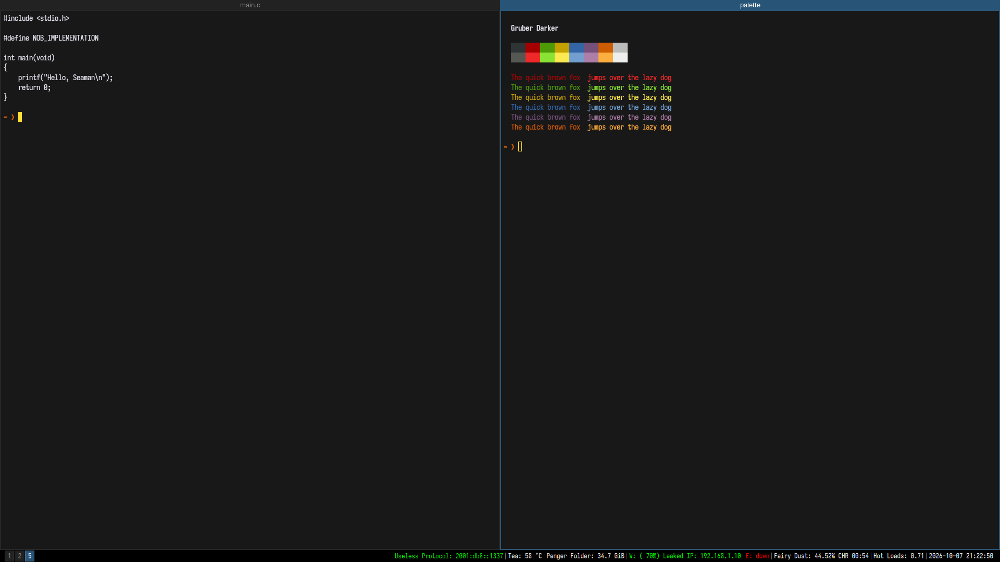

# Tsoding i3 theme for Omarchy

An [Omarchy](https://omarchy.org/) theme that makes Hyprland look like the stock i3 desktop [Tsoding](https://github.com/rexim) streams from.



Every value comes from his public [dotfiles](https://github.com/rexim/dotfiles): the i3 config, `.i3status.conf`, and `.Xresources`.

## What you get

- An i3bar at the bottom of the screen, with numbered workspace buttons on the left and real `i3status` output on the right, using his labels ("Tea", "Penger Folder", "Fairy Dust", "Hot Loads").
- i3's default blue title bars and 2px window borders.
- The Gruber Darker terminal palette for kitty and Alacritty.
- Iosevka as the terminal and bar font.
- A plain black wallpaper.
- No gaps, rounded corners, blur, shadows, transparency, or animations.

## Requirements

- Omarchy 4 or newer, with the Lua Hyprland config and the Quickshell based Omarchy shell.

## Install

```bash
curl -fsSL https://raw.githubusercontent.com/SVIGHNESH/omarchy-tsoding-theme/main/install.sh | bash
```

Or from a checkout, if you want to read the script first:

```bash
git clone https://github.com/SVIGHNESH/omarchy-tsoding-theme.git
cd omarchy-tsoding-theme
./install.sh
```

The installer asks for your sudo password once, to install two packages.
Log out and back in afterwards so the title bars pick up Iosevka.

### What the installer does

1. Installs `ttc-iosevka` and `i3status` with pacman.
2. Copies the theme to `~/.config/omarchy/themes/tsoding`.
3. Copies three bar widgets to `~/.config/omarchy/plugins/`: `vighnesh.i3-workspaces`, `vighnesh.i3status`, and `vighnesh.i3bar-lock`.
4. Installs a `theme-set` hook at `~/.config/omarchy/hooks/theme-set.d/tsoding-i3bar`.
5. Appends one line to `~/.config/hypr/hyprland.lua` so a theme can load Hyprland settings after your own `looknfeel.lua`. A timestamped backup is saved next to it.
6. Runs `omarchy theme set tsoding`.

Running the installer again updates an existing install.

### Colors only

`omarchy theme install` also works, but it only gives you the colors, the wallpaper, and the flat menu and notification styling:

```bash
omarchy theme install https://github.com/SVIGHNESH/omarchy-tsoding-theme
```

Omarchy drops Lua and terminal configs from themes installed this way, and it does not install widgets or hooks.
You get no i3bar, no title bars, and the generated terminal palette is slightly off from the original.
Use `install.sh` for the full look.

## Using it

Switch to it and away from it like any other theme:

```bash
omarchy theme set tsoding
omarchy theme set <another theme>
```

Omarchy keeps the bar layout and the system font outside of themes, so the hook handles them.
When you set `tsoding` it saves your current bar layout and font, then switches to the i3bar layout and Iosevka.
When you set any other theme it puts your bar and font back.

While the theme is active your usual bar widgets (audio, network, clock and so on) are hidden.
Their keybindings still work.

The bar is locked while the theme is active.
The Omarchy bar normally lets you drag widgets to reorder them and drag the bar to another screen edge, which is easy to do by accident.
An invisible widget, `vighnesh.i3bar-lock`, puts the i3bar layout back within a second if it changes.
The lock is part of this theme's bar only, so every other theme keeps the normal drag behavior.
To change the layout on purpose, edit `~/.config/omarchy/themes/tsoding/bar.json`.

## Privacy

The status bar shows your IPv6 address and your LAN IP address at all times.
That is the "Leaked IP" joke from the original config.
If you share your screen or post screenshots, edit `~/.config/omarchy/plugins/vighnesh.i3status/i3status.conf` and remove the `ipv6` line from `order` and `%ip` from the `wireless` and `ethernet` formats.

That file is a normal i3status config, so you can also use it to change what the bar shows.

## Differences from real i3

- Title bars are Hyprland group bars, so the title is centered instead of left-aligned.
- Only windows opened after the theme is set are guaranteed to get a title bar.
- Screen-edge borders are hidden only when a window is alone on its workspace. With splits, the outer 2px border stays visible.
- On Omarchy 4.0.4, menus and the launcher keep the default font, because `omarchy font set` does not override the `monospace` alias there.
- The status bar refreshes every 5 seconds, as in the original config, so the clock jumps in 5 second steps.

## Uninstall

Switch to another theme first, then run:

```bash
curl -fsSL https://raw.githubusercontent.com/SVIGHNESH/omarchy-tsoding-theme/main/uninstall.sh | bash
```

This removes the theme, the widgets, the hook, and the line added to `hyprland.lua`.
The two packages stay installed.

## Layout

| Path | Purpose |
|---|---|
| `colors.toml`, `kitty.conf`, `alacritty.toml`, `neovim.lua` | Gruber Darker palette |
| `hyprland.lua`, `hyprland-final.lua` | i3 borders, title bars, and the flat look |
| `shell.*.toml` | Bar, menu, launcher, popup and notification colors |
| `bar.json` | The i3bar layout the hook swaps in |
| `plugins/` | The workspace, i3status and layout lock bar widgets |
| `hooks/tsoding-i3bar` | Saves and restores the bar layout and font |

## Credits

- [Tsoding](https://github.com/rexim) for the look. `plugins/vighnesh.i3status/i3status.conf` is his `.i3status.conf` with one added line, and the terminal palette is his `.Xresources`.
- [Gruber Darker](https://github.com/rexim/gruber-darker-theme) for the palette.
- [i3](https://i3wm.org/) for the default colors this theme reproduces.

This is a fan project and is not affiliated with Tsoding.

## License

MIT, see [LICENSE](LICENSE).
